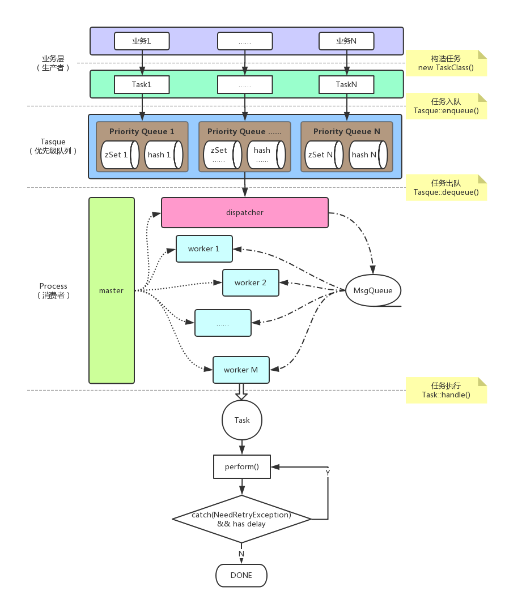

# tasque [](https://travis-ci.org/out001a/tasque)

## 定时优先级任务处理

### 背景

设计开发这个系统的初衷是为了满足实际业务中对各种异步延时任务的处理需求：
1. 定时  
任务可以在指定的时间自动执行
2. 重试  
任务执行失败时，需要根据指定的规则在特定的时间间隔后重试，直到执行成功或规则结束为止
3. 时间要求是秒级

### 架构



### 使用

* 加载

    1. 执行 `composer require out001a/tasque`，
        或者将依赖添加到项目的`composer.json`文件中，
        ```json
        {
            "require": {
                "out001a/tasque": "1.*"
            }
        }
        ```
        然后执行 `composer install` 或 `composer update`
        
    2. 在代码中添加
        ```php
        require 'vendor/autoload.php';
        ```

* 示例
    - `tests/bin/test.php`是创建任务并入队的例子
    - `tests/bin/monitor.php`是后台进程分发并处理任务的例子

### 简介

包含三个相对独立的组件：进程、任务和优先级队列。

1. 进程

    进程组件在`src/Process`目录下，在我之前的一个小项目[php-process](https://github.com/out001a/php-process)的基础上做了些改进，可以满足在生产环境中使用。

    用法如下：
    ```php
    // 初始化，自定义一些参数
    Process::init(消息队列对象, 同时存在的最大子进程数, fork子进程的时间间隔);
    Process::register('taskCount', function () {
        // 返回待处理的任务数（随便写个数也可以😄）
        return 1;
    });
    Process::register('dispatch', function() {
        // 分发待处理的任务列表，需要返回array
        return array();
    });
    Process::register('worker',  function() {
        // 注册work进程的业务逻辑
        return do_work();
    });
    // 执行
    Process::handle();
    ```
    
2. 任务

    在`src/Task`目录下，实现了一个抽象的基础任务类和任务需要重试时应抛出的异常。业务开发时应该基于抽象类实现自己的任务处理逻辑。

3. 优先级队列

    `src/Tasque.php`，基于redis实现了入队、出队等操作。出队按照队列元素的score值从小到大进行。

### 单元测试

```bash
./vendor/bin/phpunit
```

### TODO
1. redis断线重连处理
2. 支持平滑重启
3. inotify监控指定文件的变化并自动重启进程
4. 加入日志组件
5. 使用环境变量控制各种参数
6. Web控制台